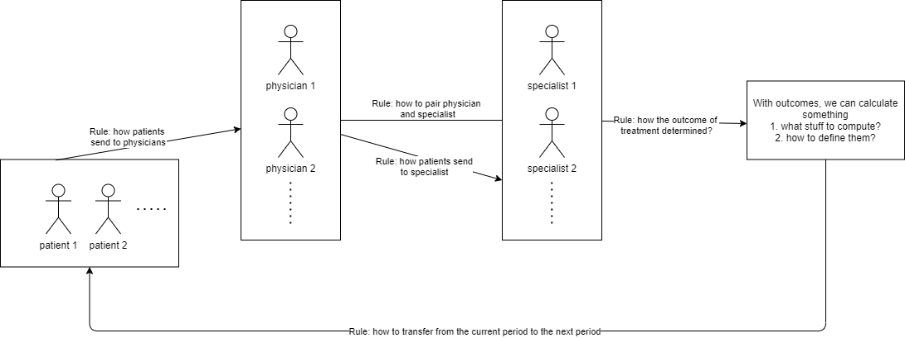

# Story

## Rule: how patients sent to physicians?

For each physician, there will be 4 to 6 patients allocated to. **Randomly**. When allocated to a physician, the outcome of a patient is determined (in the current period).

## Rule: how to determine the quality of a specialist?

One specialist has one time-invariant quality across physicians. Such a number is drawn from a **standard uniform distribution**.

## Rule: how the outcome of patients are determined?

The outcome of a patient is a standard **uniform** random variable. Such a number is time-variant i.e. if one patient goes to the hospital in multiple periods, then his patient outcomes are independently drawn from standard uniform distribution in each period.

## Rule: how patients sent to specialist (given a physician)?

Given a physician, suppose there are $x$ distinct specialists paired. One specialist can simultaneously serve multiple physicians.

All specialists of one physician have market shares (or probability of being chosen) whose summation is 1. It follows a uniform discrete distribution.

When one patient comes to the given physician, then he/she will be randomly allocated to one of the $x$ specialists according to the discrete distribution. Specifically, suppose specialists B,C,D for physician A where B takes 20% market of A, C takes 30% and D takes 50%. Then, a patient has 20% probability to be sent to specialist B once he/she was sent to physician A. Similarly, the probability to C is 30% and to D is 50%.

## Rule: how to pair physicians and specialists?

Each physician will be paired with 5 distinct specialists **uniformly** randomly. One specialist can serve multiple physicians.

## Rule: how the outcome of treatments determined?

There are two kinds of outcomes: 0 for alive and 1 for dead. The outcome is a random variable and we define
$$
\text{Treatment outcome} = \begin{cases}
	1 & \text{if specialist quality > patient outcome} \\
	0 & \text{otherwise}
\end{cases}
$$

## Rule: how to calculate the success rate for a specialist given physician?

In each period, the success rate of a specialist is defined as
$$
\text{success rate}_{\text{specialist}}|\text{physician} := \frac{\text{num of alive patients}}{\text{total num of received patients}}
$$
In one period, one specialist can have only one success rate at the place of one physician. But the specialist can have multiple success rate at the places of different physicians.

## Rule: how to transfer from the current period to the next period?

* We assume that
    * The physician-specialist pairs do not change by time. One physician will always work with the same specialists once the pairs were determined
* What information to inherit? What information of this period will affect the next period?
    * Success rate this period $\implies$ market share in the next period
* How?
    * Given one specific physician, if a paired specialist has got a success rate $s_t\in[0,1]$ and the market share of this specialist is $x_t\in[0,1]$. 
    * When going to the next period, the ranking of market share of specialist for one given physician should stay the same. e.g. if physician A has specialists B, C, D in this period, B takes 20%, C takes 30%, D takes 50%; then in the next period, the number of these shares may change but the relationship $B<C<D$ is kept.

